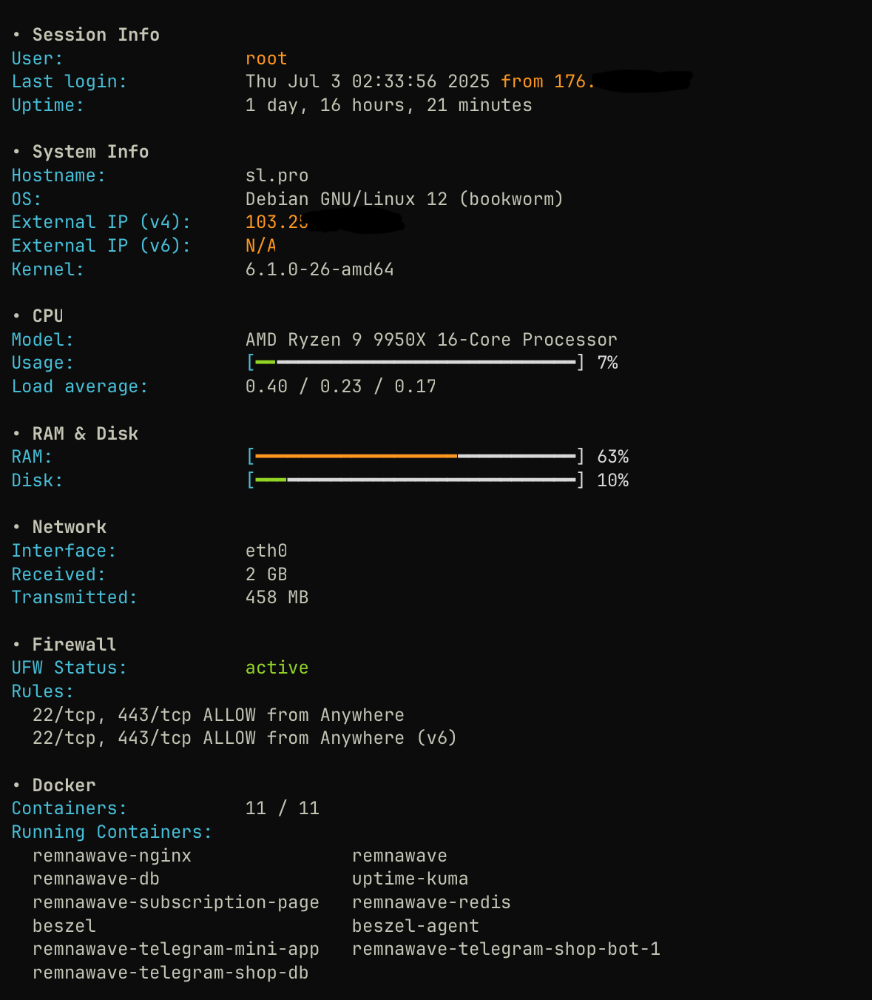

## Installation
### Root:

```
bash <(curl -fsSL https://raw.githubusercontent.com/distillium/motd/main/install-motd.sh)
```

### Sudo:

```
curl -fsSL https://raw.githubusercontent.com/distillium/motd/main/install-motd.sh | sudo bash
```

## Commands

- `rw-motd` — manually display the current MOTD.

- `rw-motd-set` — open a menu to enable/disable MOTD info blocks adn logo

The MOTD includes sections for system information and Docker containers.
It can also display the UFW firewall status, and optionally list active
rules when this feature is enabled via `rw-motd-set`.
